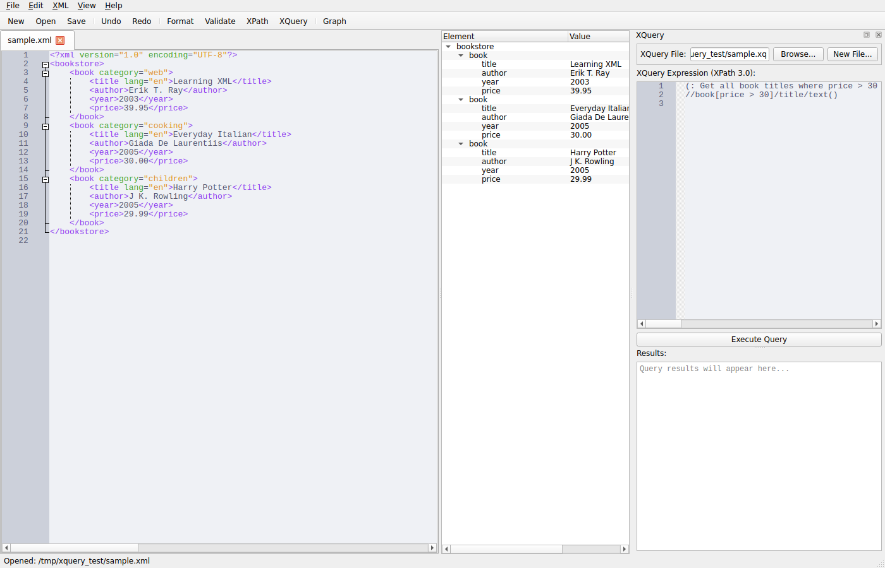
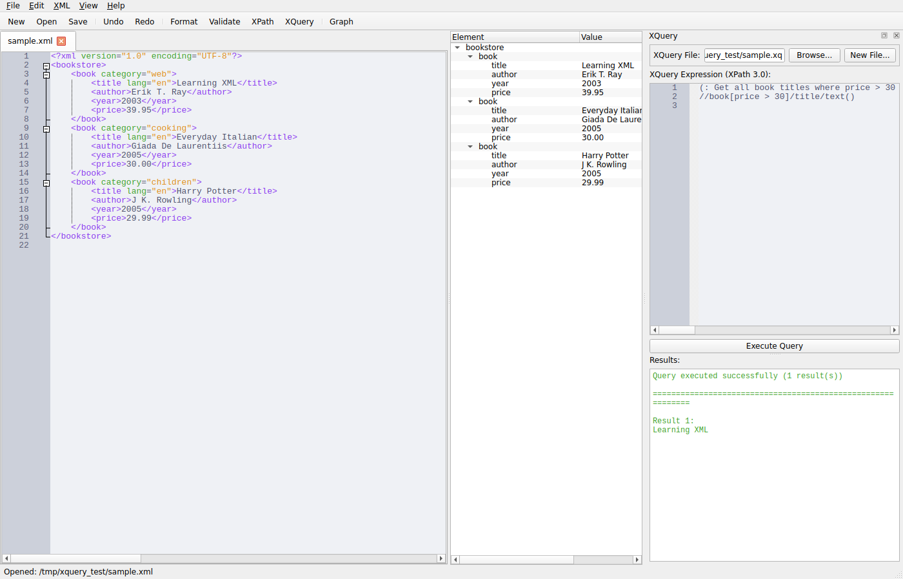

# Screenshots

This document explains how to capture screenshots of the XML Editor application for documentation purposes.

## Prerequisites

The screenshot capture script requires:
- Python 3.8+
- PyQt6 and all application dependencies
- Xvfb (for headless display) or Qt offscreen platform

## Taking Screenshots

### Method 1: Using Qt Offscreen Platform (Recommended)

The simplest method is to use Qt's offscreen platform plugin, which doesn't require any display server:

```bash
# Run the screenshot script
QT_QPA_PLATFORM=offscreen python take_screenshots.py
```

### Method 2: Using Xvfb

If you prefer to use a virtual X server:

```bash
# Install xvfb if not already installed
sudo apt-get install xvfb

# Run with xvfb-run
xvfb-run -a python take_screenshots.py
```

## Required System Packages

For GUI libraries support, install these packages:

```bash
sudo apt-get update
sudo apt-get install -y \
    libegl1 \
    libxkbcommon-x11-0 \
    libxcb-icccm4 \
    libxcb-image0 \
    libxcb-keysyms1 \
    libxcb-render-util0 \
    libxcb-xinerama0 \
    libxcb-cursor0
```

## Screenshot Script

The `take_screenshots.py` script automates the screenshot capture process:

1. Launches the XML Editor
2. Loads a sample XML file
3. Opens the XQuery panel
4. Loads a sample XQuery file
5. Takes a screenshot before query execution
6. Executes the query
7. Takes a screenshot after showing results

All screenshots are saved in the `screenshots/` directory.

## Sample Files

The script expects sample files in `/tmp/xquery_test/`:
- `sample.xml` - Sample XML document
- `sample.xq` - Sample XQuery expression

These files are created automatically by the script if they don't exist, or you can create them manually:

**sample.xml:**
```xml
<?xml version="1.0" encoding="UTF-8"?>
<bookstore>
    <book category="web">
        <title lang="en">Learning XML</title>
        <author>Erik T. Ray</author>
        <year>2003</year>
        <price>39.95</price>
    </book>
    <book category="cooking">
        <title lang="en">Everyday Italian</title>
        <author>Giada De Laurentiis</author>
        <year>2005</year>
        <price>30.00</price>
    </book>
</bookstore>
```

**sample.xq:**
```xquery
(: Get all book titles where price > 30 :)
//book[price > 30]/title/text()
```

## Current Screenshots

### XQuery Panel with Query


Shows the XQuery panel with:
- Sample XML document loaded in the main editor
- XQuery file loaded in the query editor
- File path displayed
- Split view layout

### XQuery Panel with Results


Shows the XQuery panel after execution with:
- Query results displayed in the bottom pane
- Success message and result count
- Formatted output

## GitHub Actions Integration

For automated screenshot generation in CI/CD, add the required packages to `.github/workflows/copilot-setup-steps.yml`:

```yaml
- name: Install GUI dependencies for screenshots
  run: |
    sudo apt-get update
    sudo apt-get install -y \
      libegl1 \
      libxkbcommon-x11-0 \
      libxcb-icccm4 \
      libxcb-image0 \
      libxcb-keysyms1 \
      libxcb-render-util0 \
      libxcb-xinerama0 \
      libxcb-cursor0
```

Then run the screenshot script with:

```bash
QT_QPA_PLATFORM=offscreen python take_screenshots.py
```

## Troubleshooting

### Error: "No module named 'PyQt6'"

Install dependencies:
```bash
pip install -r requirements.txt
pip install PyQt6 PyQt6-QScintilla
```

### Error: "libEGL.so.1: cannot open shared object file"

Install the EGL library:
```bash
sudo apt-get install libegl1
```

### Error: "Could not load the Qt platform plugin 'xcb'"

Use the offscreen platform instead:
```bash
QT_QPA_PLATFORM=offscreen python take_screenshots.py
```

Or install the missing xcb dependencies:
```bash
sudo apt-get install libxcb-cursor0 libxkbcommon-x11-0
```

## Customizing Screenshots

To capture different screenshots, modify `take_screenshots.py`:

1. Adjust window size in the `take_screenshots()` function
2. Add or modify steps in the step functions
3. Change the sample XML or XQuery files
4. Add additional screenshot captures at different points

Example:
```python
def custom_step():
    """Take a custom screenshot"""
    # Perform actions...
    pixmap = window.grab()
    path = os.path.join(screenshot_dir, "my_screenshot.png")
    pixmap.save(path)
```
